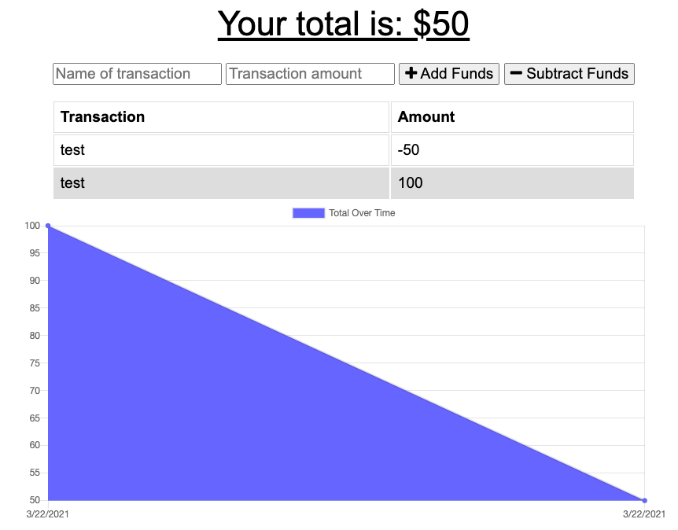

# PWA-Budget-Tracker

## Table of Contents

- [Description](#description)
- [What To Expect](#what-to-expect)
- [Installation](#installation)
- [Usage](#usage)
- [License](#license)
- [Contributing](#contributing)
- [Tests](#tests)
- [Questions](#questions)

## What To Expect:

## Description

AS AN avid traveller
I WANT to be able to track my withdrawals and deposits with or without a data/internet connection
SO THAT my account balance is accurate when I am traveling

## Installation

For link to Web App click [here]()

## Usage

Giving users a fast and easy way to track their money is important, but allowing them to access that information anytime is even more important.
Having offline functionality is paramount to our applications success.

## License

- [License File](./LICENSE.txt)

## Contributing

Feel free to fork and improve!

## Tests

NodeJS

## Questions?

- Msas12: https://github.com/Msas12
- m5455y@gmail.com
